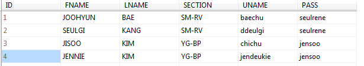
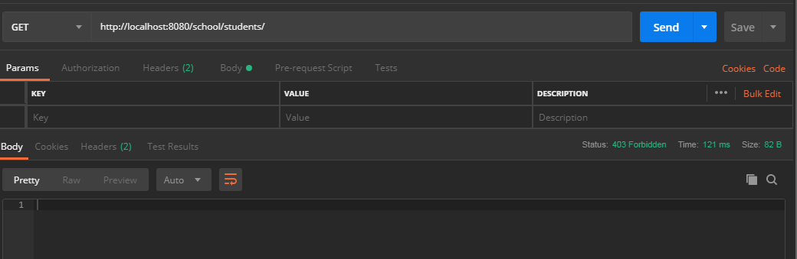
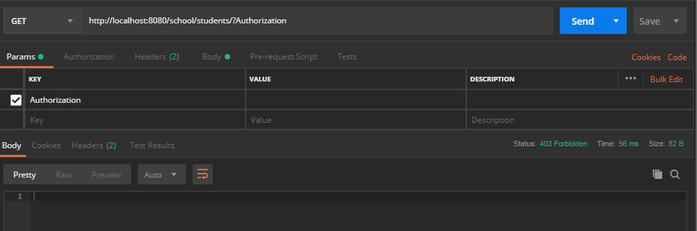
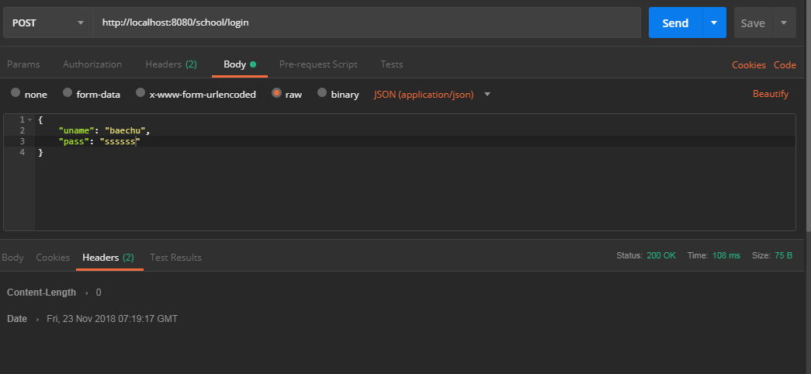
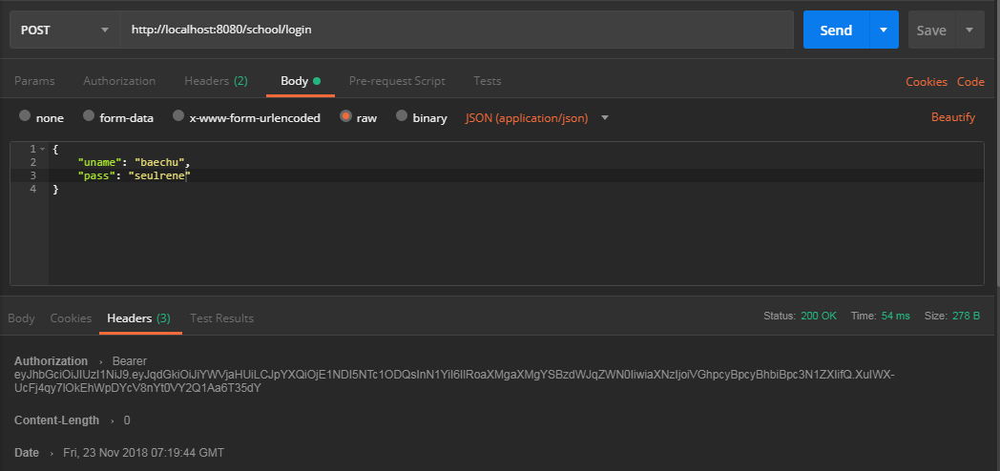
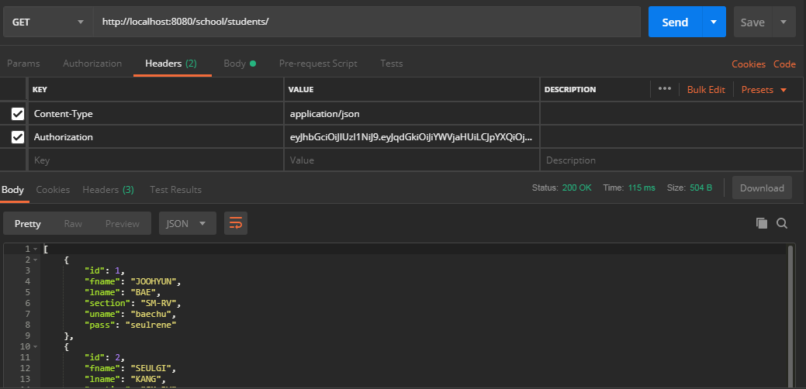

# Rest-CRUD-Angular-XML-MyBatis-JWT-Interceptor-Part1

#Preview

Database

Accessing Data without Token

Accessing Data with Empty Token

Login with Invalid Credentials

Login with Valid Credentials

Login with Valid Token

